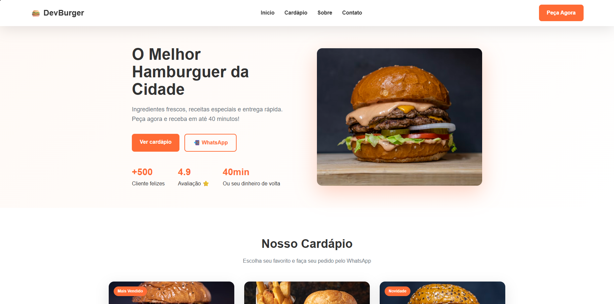

# 🍔 DevBurger — Landing Page de Hamburgueria

Aplicação web desenvolvida para simular o site institucional de uma hamburgueria artesanal, com foco em apresentação de produtos, conversão de pedidos e experiência do usuário.

O projeto foi criado com o objetivo de praticar construção de interfaces modernas, responsividade e organização visual voltada para negócios locais.

---

## 🚀 Demonstração

## 📸 Preview

🔗 **Acesse o projeto:**  
https://niccolaspeixoto.github.io/Hamburgueria-do-Dev/

---

## 🎯 Objetivo do Projeto

Desenvolver uma landing page completa para uma hamburgueria fictícia, simulando um cenário real de cliente, incluindo:

- Apresentação da marca
- Cardápio digital
- Integração direta com WhatsApp para pedidos
- Layout responsivo e moderno
- Estrutura semântica e organizada

---

## 🛠️ Tecnologias Utilizadas

- HTML5 (estrutura semântica)
- CSS3
  - Flexbox
  - Grid Layout
  - Variáveis CSS
  - Responsividade
- Design responsivo (mobile-first concepts)
- Integração via links dinâmicos do WhatsApp

---

## ✨ Funcionalidades

✅ Navegação suave entre seções  
✅ Menu digital interativo  
✅ Botões de pedido direto via WhatsApp  
✅ Layout responsivo para diferentes dispositivos  
✅ Hero section com foco em conversão  
✅ Cards de produtos reutilizáveis  
✅ Estrutura organizada para escalabilidade

---

## 🧠 Desafios Técnicos

Durante o desenvolvimento, os principais desafios foram:

- Estruturar um layout realista utilizando **CSS Grid e Flexbox**
- Criar componentes visuais reutilizáveis (cards do cardápio)
- Manter consistência visual usando variáveis CSS
- Organizar o fluxo da página visando experiência do usuário e conversão

---

## 📱 Responsividade

O projeto foi desenvolvido para adaptação em:

- 📱 Mobile
- 💻 Desktop
- 📟 Tablets

---

## 🎨 Aprendizados

Este projeto contribuiu para o aprimoramento em:

- Estruturação semântica HTML
- Organização de estilos CSS escaláveis
- Criação de layouts comerciais reais
- Pensamento de UI voltado para negócios
- Boas práticas de responsividade

---

## 👨‍💻 Autor

**Niccolas Peixoto**

- LinkedIn: https://www.linkedin.com/in/niccolas-peixoto/
- Portfólio: https://niccolaspeixoto.github.io/portif-lio/

---

⭐ Projeto desenvolvido para fins educacionais e evolução profissional.
